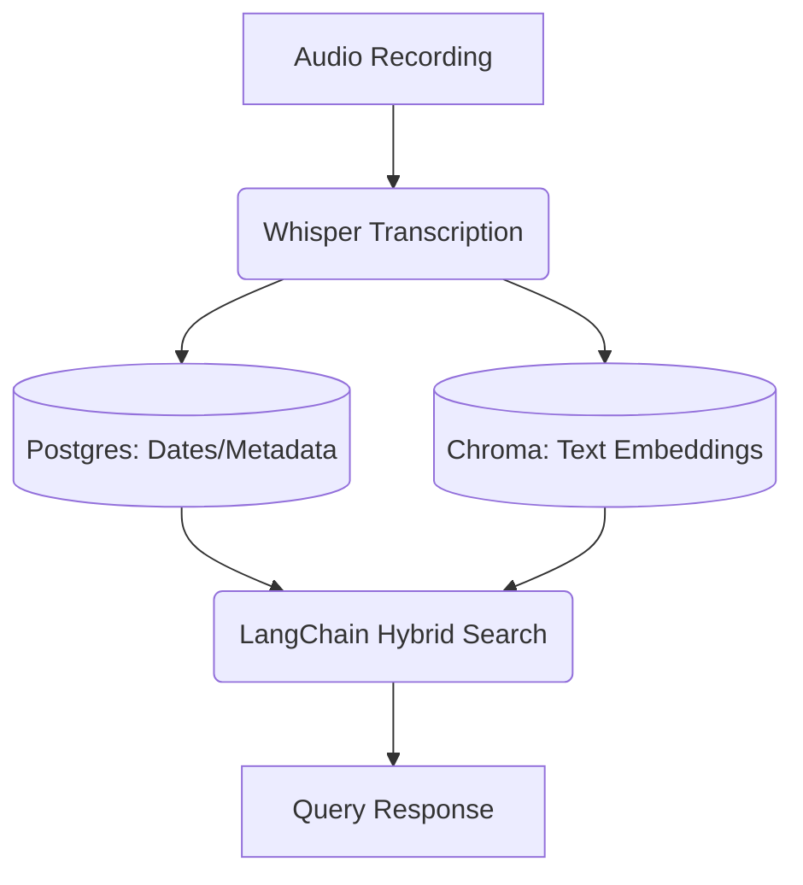

# Diane Project Context

[Paste your original project summary/architecture from this thread here]

## Current State (Update this weekly!)

- **Completed**: Postgres DB setup (WIP), Whisper integration
- **Next Focus**: Chroma DB integration, Hybrid Search

## Workflow Diagram

